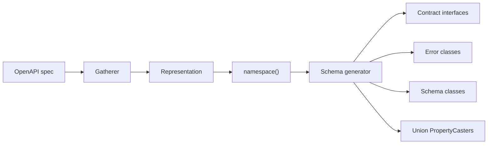

# generator-schema

[`FileGenerator`](https://github.com/php-openapi-tools/contract) for [OpenAPI Tools](https://github.com/php-openapi-tools) that turns gathered schema metadata into PHP source files: readonly value objects, contract interfaces, throwable error wrappers, and property caster attributes for union-typed fields.


[](https://packagist.org/packages/openapi-tools/generator-schema)
[](https://packagist.org/packages/openapi-tools/generator-schema/stats)
[](https://packagist.org/packages/openapi-tools/generator-schema)

## Requirements

- PHP `^8.4`
- `ext-json`

## Installation

```
composer require openapi-tools/generator-schema
```

## Where it fits

This package runs during step 4 of the OpenAPI Tools pipeline — after [`gatherer`](https://github.com/php-openapi-tools/gatherer) has built a [`representation`](https://github.com/php-openapi-tools/representation) and class names have been resolved with `Representation::namespace()`:



Register `Schema` **before** [`generator-hydrator`](https://github.com/php-openapi-tools/generator-hydrator). Hydrators reflect on the schema classes this generator emits, and the generator run loop `include_once`s each written file so later generators can depend on freshly emitted types.

## Components

| Class | Purpose |
| --- | --- |
| `Schema` | Entry-point `FileGenerator`; delegates to the internal generators below |
| `Internal\Contract` | Emits deduplicated contract interfaces with `@property` PHPDoc |
| `Internal\Error` | Emits one final `\Error` subclass per schema |
| `Internal\Schema` | Emits readonly schema classes, alias classes, and union caster attributes |
| `Internal\Schema\SingleCastUnionToType` | `PropertyCaster` for a single union-typed property |
| `Internal\Schema\MultipleCastUnionToType` | `PropertyCaster` for an array whose items are a union |

Type resolution and PHPDoc formatting delegate to [`generator-utils`](https://github.com/php-openapi-tools/generator-utils) (`PropertyTypeResolver`, `UnionTypeUtils`, `DocBlockBuilder`).

## Usage

`Schema` takes a shared [`nikic/php-parser`](https://github.com/nikic/PHP-Parser) `BuilderFactory` and is attached to a package's `generators` list:

```php
use OpenAPITools\Generator\Schema\Schema;
use PhpParser\BuilderFactory;

$builderFactory = new BuilderFactory();

// inside Package(..., generators: [ new Schema($builderFactory), ... ])
```

A full configuration example lives in [`openapi-tools/generator`](https://github.com/php-openapi-tools/generator#configuration). At minimum you need gathering with schema aliasing enabled when your spec contains structurally identical inline objects:

```php
new Gathering\Schemas(
    allowDuplication: true,
    useAliasesForDuplication: true,
),
```

### Direct invocation

Useful in tests and custom tooling:

```php
use OpenAPITools\Generator\Schema\Schema;
use PhpParser\BuilderFactory;

$generator = new Schema(new BuilderFactory());

foreach ($generator->generate($package, $representation->namespace($package->namespace)) as $file) {
    // $file->pathPrefix  — e.g. "src"
    // $file->fqcn        — e.g. "Schema\\Basic"
    // $file->contents    — PhpParser Node or pre-rendered string
}
```

## Generation order

`Schema::generate()` yields files in a fixed order for every schema in the representation:

1. **Contracts** — one interface per unique contract, deduplicated by FQCN across all schemas.
2. **Errors** — one `\Error` subclass at `{namespace}\Schema\Error\{SchemaName}`.
3. **Schema classes** — the readonly value object, any alias classes, and per-property union caster attributes.

Union caster classes are emitted as part of step 3 when a property needs them.

## Output layout

Given namespace `ApiClients\Client\Example` and a component schema named `Basic`:

| Relative path | Kind |
| --- | --- |
| `Contract/Basic.php` | Interface with `@property` lines |
| `Schema/Basic.php` | Final readonly schema class |
| `Schema/Error/Basic.php` | Final error class |
| `Schema/AliasAbstract/T{hash}/…php` | Abstract base when aliases exist |
| `Schema/{AliasName}.php` | Final readonly alias extending the abstract base |
| `Internal/Attribute/CastUnionToType/Single/…php` | Union property caster |
| `Internal/Attribute/CastUnionToType/Multiple/…php` | Array-of-union property caster |

The `{hash}` in alias abstract class names is derived from the schema's serialized JSON so structurally identical schemas share one abstract base.

## Generated code

### Contract interfaces

Interfaces carry `@property` PHPDoc from the contract properties gathered for that shape. The interface body is empty; schemas implement it:

```php
namespace ApiClients\Client\Example\Contract;

/**
 * @property string $id
 * @property string $name
 */
interface Basic
{
}
```

### Schema classes

Every schema class is `readonly`, implements its contract(s), and exposes metadata through constants:

| Constant | Visibility | Purpose |
| --- | --- | --- |
| `SCHEMA_JSON` | `private` | Pretty-printed JSON Schema fragment for runtime validation |
| `SCHEMA_TITLE` | `public` | OpenAPI `title` |
| `SCHEMA_DESCRIPTION` | `public` | OpenAPI `description` |
| `SCHEMA_EXAMPLE_DATA` | `private` | Pretty-printed example payload assembled during gathering |

Constructor parameters are public promoted properties. Property names in PHP may differ from JSON keys — when they do, [`EventSauce ObjectHydrator`](https://github.com/EventSaucePHP/ObjectHydrator) `#[MapFrom('json_key')]` is attached.

```php
namespace ApiClients\Client\Example\Schema;

final readonly class Basic implements \ApiClients\Client\Example\Contract\Basic
{
    private const SCHEMA_JSON = '{
    "type": "object",
    ...
}';
    public const SCHEMA_TITLE = 'basic';
    public const SCHEMA_DESCRIPTION = '';
    private const SCHEMA_EXAMPLE_DATA = '[ ... ]';

    public function __construct(
        public string $id,
        public string $name,
    ) {
    }
}
```

Downstream code (webhook middleware, validators) reads `SCHEMA_JSON` for JSON Schema validation without shipping a separate schema file.

#### Nested objects and arrays

| OpenAPI shape | Generated PHP |
| --- | --- |
| Property referencing another component schema | Constructor parameter typed to that schema class |
| `array` of schema objects | `#[CastListToType(OtherSchema::class)]` on the parameter |
| Scalar / simple union | Native PHP union type on the parameter (`string\|int\|float`) |
| Object union (no discriminator) | Generated `PropertyCaster` attribute class on the parameter |
| Array of object union items | Pair of `Single` + `Multiple` caster classes |

For scalar unions such as Jira-style issue field values, duplicate type tokens are collapsed so you get `string\|int\|float`, not `string\|int\|float\|int`:

```php
// from DoubleUseOfTypes.yaml — type: [null, string, number, integer] + anyOf
public function __construct(public string|int|float|null $value)
{
}
```

#### Object unions without discriminator

When a property resolves to multiple object schemas, the generator emits a `PropertyCaster` that fingerprints incoming arrays by sorted key names (and enum values when present), then hydrates the matching schema class:

```php
// Simplified behaviour of generated SingleCastUnionToType classes
if (is_array($value)) {
    $signature = implode('|', sort(array_unique(array_keys($value))));
    if ($signature === 'preferred|value') { /* hydrate PreferredName */ }
    if ($signature === 'value') { /* hydrate FirstName */ }
}
return $value;
```

Caster classes live under `Internal\Attribute\CastUnionToType\` and are referenced as parameter attributes on the schema constructor.

#### Schema aliases

When [`registry`](https://github.com/php-openapi-tools/registry) records structurally identical inline schemas as aliases (`useAliasesForDuplication: true`), the generator:

1. Moves the shared implementation into an **abstract** readonly class under `Schema\AliasAbstract\`.
2. Emits one **final** readonly alias class per registered name, each extending the abstract base.

The canonical class name from gathering becomes the last alias; the abstract base holds the constructor, constants, and union casters.

### Error classes

Each schema gets a final error class extending `\Error`. Instances carry the HTTP status code and a hydrated copy of the schema:

```php
namespace ApiClients\Client\Example\Schema\Error;

final class Basic extends \Error
{
    public function __construct(
        public int $status,
        public \ApiClients\Client\Example\Schema\Basic $error,
    ) {
    }
}
```

These are used for error responses registered during gathering (`ThrowableSchema` in the registry). The representation also tracks an `errorClassNameAliased` path for deduplicated error shapes; this generator emits the primary `Schema\Error\{Name}` class.

## Supported patterns

Behaviour is locked down through shared fixtures in [`openapi-tools/test-data`](https://github.com/php-openapi-tools/test-data). Each YAML file has a matching assertion class under `tests/DataTests/`.

| Fixture | What it exercises |
| --- | --- |
| `Basic` | Minimal object, `$ref`, UUID format, response headers |
| `ExampleData` | Scalars, formats, patterns, arrays, nullable unions, example constants |
| `Aliases` | Structurally identical inline objects → abstract base + alias classes |
| `NestedSchema` | Inline nested objects without `$ref` |
| `NestedReferenceSchema` | Nested objects via component `$ref` |
| `TripleNestedSchema` | Deep nesting with `$ref` on nested `schema` keyword |
| `DoubleUseOfTypes` | OpenAPI 3.1 `type` array combined with `anyOf` on one property |

Run the suite:

```shell
make unit-testing
```

For the full fixture roadmap and situation coverage matrix, see [`test-data/src/DataSets/PLAN.md`](https://github.com/php-openapi-tools/test-data/blob/main/src/DataSets/PLAN.md).

## Related packages

| Package | Relationship |
| --- | --- |
| [`contract`](https://github.com/php-openapi-tools/contract) | `FileGenerator` and `Package` interfaces |
| [`representation`](https://github.com/php-openapi-tools/representation) | Input model (`Namespaced\Schema`, `Contract`, `Property`) |
| [`gatherer`](https://github.com/php-openapi-tools/gatherer) | Builds the representation this generator consumes |
| [`registry`](https://github.com/php-openapi-tools/registry) | Schema deduplication and alias registration during gathering |
| [`generator-utils`](https://github.com/php-openapi-tools/generator-utils) | AST builders and type resolution helpers |
| [`generator-hydrator`](https://github.com/php-openapi-tools/generator-hydrator) | Typically runs after this package |
| [`generator`](https://github.com/php-openapi-tools/generator) | CLI and run loop that orchestrates all generators |

## Contributing

Please see [CONTRIBUTING](CONTRIBUTING.md) for details.

## License

The MIT License (MIT)

Copyright (c) 2026 Cees-Jan Kiewiet

Permission is hereby granted, free of charge, to any person obtaining a copy
of this software and associated documentation files (the "Software"), to deal
in the Software without restriction, including without limitation the rights
to use, copy, modify, merge, publish, distribute, sublicense, and/or sell
copies of the Software, and to permit persons to whom the Software is
furnished to do so, subject to the following conditions:

The above copyright notice and this permission notice shall be included in all
copies or substantial portions of the Software.

THE SOFTWARE IS PROVIDED "AS IS", WITHOUT WARRANTY OF ANY KIND, EXPRESS OR
IMPLIED, INCLUDING BUT NOT LIMITED TO THE WARRANTIES OF MERCHANTABILITY,
FITNESS FOR A PARTICULAR PURPOSE AND NONINFRINGEMENT. IN NO EVENT SHALL THE
AUTHORS OR COPYRIGHT HOLDERS BE LIABLE FOR ANY CLAIM, DAMAGES OR OTHER
LIABILITY, WHETHER IN AN ACTION OF CONTRACT, TORT OR OTHERWISE, ARISING FROM,
OUT OF OR IN CONNECTION WITH THE SOFTWARE OR THE USE OR OTHER DEALINGS IN THE
SOFTWARE.
