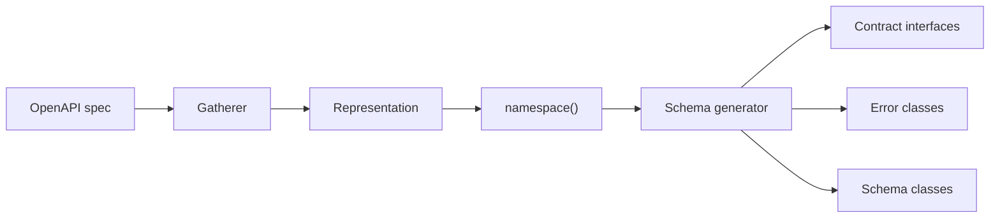

generator-schema
================

[`FileGenerator`](https://github.com/php-openapi-tools/contract) for [OpenAPI Tools](https://github.com/php-openapi-tools) that turns gathered schema metadata into PHP source files: readonly value objects, contract interfaces, and throwable error wrappers.


[](https://packagist.org/packages/openapi-tools/generator-schema)
[](https://packagist.org/packages/openapi-tools/generator-schema/stats)
[](https://packagist.org/packages/openapi-tools/generator-schema)

Requirements
------------

- PHP `^8.4`
- `ext-json`

Installation
------------

```
composer require openapi-tools/generator-schema
```

Where it fits
-------------

This package runs after [`gatherer`](https://github.com/php-openapi-tools/gatherer) has built a [`representation`](https://github.com/php-openapi-tools/representation) and class names have been resolved with `Representation::namespace()`. Register `Schema` **before** [`generator-hydrator`](https://github.com/php-openapi-tools/generator-hydrator).



Example
-------

The snippet below is generated by running the schema generator against a real OpenAPI input when you run `make generate-readme`. The example driver lives in [`etc/docs/README.php`](etc/docs/README.php).

**Input** — OpenAPI component schema (`example-input.yaml`):
```yaml
openapi: "3.1.0"
info:
  version: 1.0.0
  title: Swagger Petstore
  license:
    name: MIT
servers:
  - url: http://api.example.com/v1/
paths:
  /:
    get:
      summary: Root
      operationId: root
      tags:
        - root
      responses:
        200:
          description: A paged array of pets
          headers:
            x-next:
              description: A link to the next page of responses
              schema:
                type: string
          content:
            application/json:
              schema:
                - $ref: "#/components/schemas/basic"
components:
  schemas:
    basic:
      type: object
      required:
        - id
        - name
      properties:
        id:
          type: string
          format: uuid
        name:
          type: string

```
Output
------

Running gatherer + `Schema::generate()` against the input above emits these files for the `basic` schema:
src/Contract/Basic.php
----------------------

```php
<?php declare (strict_types=1);
namespace ApiClients\Client\Example\Contract;

/**
 * @property string $id
 * @property string $name
 */
interface Basic
{
}
```
src/Error/Basic.php
-------------------

```php
<?php declare (strict_types=1);
namespace ApiClients\Client\Example\Error;

final class Basic extends \Error
{
    public function __construct(public int $status, public \ApiClients\Client\Example\Schema\Basic $error)
    {
    }
}
```
src/Schema/Basic.php
--------------------

```php
<?php declare (strict_types=1);
namespace ApiClients\Client\Example\Schema;

final readonly class Basic implements \ApiClients\Client\Example\Contract\Basic
{
    const SCHEMA_JSON = '{
    "required": [
        "id",
        "name"
    ],
    "type": "object",
    "properties": {
        "id": {
            "type": "string",
            "format": "uuid"
        },
        "name": {
            "type": "string"
        }
    }
}';
    public const SCHEMA_TITLE = '';
    public const SCHEMA_DESCRIPTION = '';
    const SCHEMA_EXAMPLE_DATA = '{
    "id": "4ccda740-74c3-4cfa-8571-ebf83c8f300a",
    "name": "generated"
}';
    public function __construct(public string $id, public string $name)
    {
    }
}
```
For each schema, the generator emits three kinds of files in a fixed order:

1. **Contract** — interface with `@property` PHPDoc
2. **Error** — final `\Error` subclass carrying status code + hydrated schema
3. **Schema** — final `readonly` class with promoted constructor properties and `SCHEMA_*` constants

In a full client package, `Schema` is wired into the generator run loop alongside other `FileGenerator` implementations. A minimal direct invocation looks like this:

```php
use OpenAPITools\Generator\Schema\Schema;
use PhpParser\BuilderFactory;

$generator = new Schema(new BuilderFactory());

foreach ($generator->generate($package, $representation->namespace($package->namespace)) as $file) {
    // $file->pathPrefix  — e.g. "src"
    // $file->fqcn        — e.g. "Schema\\Basic"
    // $file->contents    — PhpParser Node
}
```

See [`openapi-tools/generator`](https://github.com/php-openapi-tools/generator#configuration) for a complete package configuration.

Related packages
----------------

| Package | Relationship |
| --- | --- |
| [`contract`](https://github.com/php-openapi-tools/contract) | `FileGenerator` and `Package` interfaces |
| [`representation`](https://github.com/php-openapi-tools/representation) | Input model consumed by this generator |
| [`gatherer`](https://github.com/php-openapi-tools/gatherer) | Builds the representation from OpenAPI |
| [`generator-utils`](https://github.com/php-openapi-tools/generator-utils) | AST builders and type resolution helpers |
| [`generator-hydrator`](https://github.com/php-openapi-tools/generator-hydrator) | Typically runs after this package |
| [`generator`](https://github.com/php-openapi-tools/generator) | CLI and run loop that orchestrates all generators |

Contributing
------------

Please see [CONTRIBUTING](CONTRIBUTING.md) for details.

License
-------

The MIT License (MIT)

Copyright (c) 2026 Cees-Jan Kiewiet

Permission is hereby granted, free of charge, to any person obtaining a copy
of this software and associated documentation files (the "Software"), to deal
in the Software without restriction, including without limitation the rights
to use, copy, modify, merge, publish, distribute, sublicense, and/or sell
copies of the Software, and to permit persons to whom the Software is
furnished to do so, subject to the following conditions:

The above copyright notice and this permission notice shall be included in all
copies or substantial portions of the Software.

THE SOFTWARE IS PROVIDED "AS IS", WITHOUT WARRANTY OF ANY KIND, EXPRESS OR
IMPLIED, INCLUDING BUT NOT LIMITED TO THE WARRANTIES OF MERCHANTABILITY,
FITNESS FOR A PARTICULAR PURPOSE AND NONINFRINGEMENT. IN NO EVENT SHALL THE
AUTHORS OR COPYRIGHT HOLDERS BE LIABLE FOR ANY CLAIM, DAMAGES OR OTHER
LIABILITY, WHETHER IN AN ACTION OF CONTRACT, TORT OR OTHERWISE, ARISING FROM,
OUT OF OR IN CONNECTION WITH THE SOFTWARE OR THE USE OR OTHER DEALINGS IN THE
SOFTWARE.

